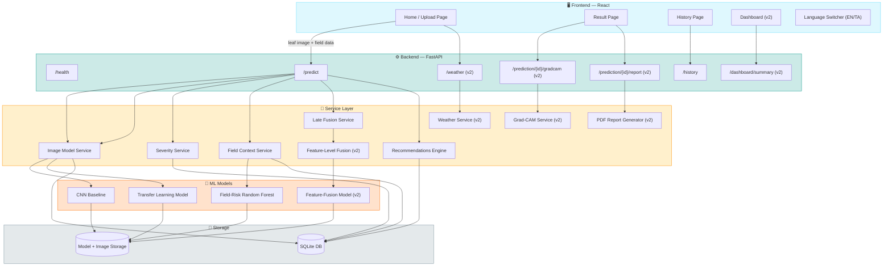
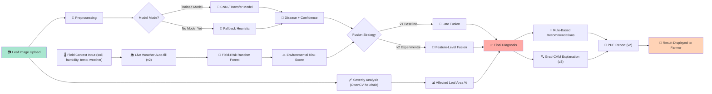

<div align="center">

# 🌿 Multimodal Crop Disease Diagnosis with Severity & Field Context

### AI-powered leaf disease detection fused with real-time field & weather context

*A full-stack, end-to-end academic project — B.Tech CSE, 4-member team*

[](https://www.python.org/)
[](https://fastapi.tiangolo.com/)
[](https://react.dev/)
[](https://www.tensorflow.org/)
[](https://www.docker.com/)
[](https://github.com/features/actions)
[]()

[]()
[]()
[]()

</div>

---

## 📖 Table of Contents

- [Overview](#-overview)
- [What's New in v2](#-whats-new-in-v2)
- [System Architecture](#-system-architecture)
- [Diagnosis Pipeline Flow](#-diagnosis-pipeline-flow)
- [Repository Structure](#-repository-structure)
- [Tech Stack](#-tech-stack)
- [Quick Start](#-quick-start)
- [Training the Models](#-training-the-models)
- [API Reference](#-api-reference)
- [Environment Variables](#-environment-variables)
- [Supported Crops & Diseases](#-supported-crops--diseases)
- [Honesty Notes — Read Before Presenting](#-honesty-notes--read-before-presenting-this-project)
- [License](#-license--academic-use)

---

## 🧩 Overview

This project diagnoses **crop diseases from a leaf image combined with structured field-context data**, returning:

| Output | Description |
|---|---|
| 🦠 **Disease + Confidence** | Predicted disease class with model confidence score |
| 📊 **Severity + Affected Area** | % of leaf area affected, computed via OpenCV heuristics |
| 🌦️ **Field/Environmental Risk** | Risk score from a Random Forest trained on field context |
| 🔍 **Explanation** | Grad-CAM visual explainability (image) + feature importances (risk) |
| ✅ **Recommendations** | Rule-based agricultural guidance |

> ⚠️ Before presenting this project, read `docs/limitations_and_future_work.md` Sections 2 & 3 — see [Honesty Notes](#-honesty-notes--read-before-presenting-this-project) below for the short version.

---

## ✨ What's New in v2

| Feature | Status |
|---|---|
| Grad-CAM explainability | ✅ Implemented (not yet diagnostically meaningful — see notes) |
| Live weather auto-fill | ✅ Implemented (unit-tested, not live-called in sandbox) |
| Feature-level multimodal fusion | ✅ Implemented + compared vs v1 late-fusion baseline |
| Field-risk model explainability | ✅ Implemented |
| Analytics dashboard | ✅ Implemented |
| PDF report generation | ✅ Implemented |
| English / Tamil UI | ✅ Implemented |
| Docker + CI | ✅ Implemented (Docker validated statically) |

**All v1 functionality is preserved and unchanged** — see `docs/api_documentation.md` for the backward-compatibility guarantee.

---

## 🏗️ System Architecture



---

## 🔄 Diagnosis Pipeline Flow



---

## 📂 Repository Structure

```
crop-disease-diagnosis/
├── README.md
├── docker-compose.yml              <- v2: run both containers together
├── .github/workflows/ci.yml        <- v2: automated tests + build validation
├── docs/                           <- academic documentation (report material)
│   ├── problem_statement.md
│   ├── literature_review.md
│   ├── methodology.md              <- architecture diagram (updated for v2)
│   ├── evaluation_plan.md          <- real experiment results + v2 fusion comparison
│   ├── limitations_and_future_work.md  <- READ THIS (Grad-CAM/synthetic-data caveats)
│   ├── api_documentation.md        <- v2: full endpoint reference
│   ├── deployment.md               <- v2: Docker/cloud deployment guide
│   ├── viva_questions_and_answers.md  <- v2
│   ├── demo_and_presentation.md
│   └── team_and_workflow.md
├── data/                           <- dataset download/organize instructions
├── scripts/                        <- convenience setup scripts
├── backend/
│   ├── Dockerfile                  <- v2
│   ├── requirements.txt
│   ├── .env.example
│   ├── app/
│   │   ├── main.py
│   │   ├── config.py
│   │   ├── database.py
│   │   ├── models/                 <- SQLAlchemy models + Pydantic schemas
│   │   ├── routers/                <- health, predict, history, weather (v2),
│   │   │                              dashboard (v2), gradcam (v2), report (v2)
│   │   ├── services/                <- image_model, severity, field_context, fusion,
│   │   │                               recommendations, gradcam (v2), weather (v2),
│   │   │                               feature_fusion (v2), report_generator (v2)
│   │   └── ml/                      <- dataset utils, training scripts, evaluation,
│   │                                    synthetic_benchmark (v2), train_feature_fusion (v2),
│   │                                    compare_fusion_approaches (v2),
│   │                                    evaluate_severity_segmentation (v2)
│   ├── storage/                     <- trained models + uploaded images + SQLite DB
│   ├── sample_data/
│   └── tests/                       <- test_api.py (v1) + test_v2_features.py (v2, 20 tests)
└── frontend/
    ├── Dockerfile                   <- v2
    ├── nginx.conf                   <- v2
    ├── package.json
    ├── .env.example
    └── src/
        ├── api/                     <- axios API service layer
        ├── i18n/                    <- v2: English/Tamil translations + context
        ├── components/              <- + GradCamDisplay, WeatherFetchButton,
        │                               ReportDownloadButton, SimpleBarChart, LanguageSwitcher (v2)
        ├── pages/                   <- Home, Result, History, + Dashboard (v2)
        └── styles/
```

Full architecture diagram (with v2 components labeled): `docs/methodology.md`.

---

## 🧰 Tech Stack

<div align="center">

| Layer | Tools |
|---|---|
| **Frontend** |    |
| **Backend** |    |
| **ML / CV** |    |
| **Infra** |    |

</div>

---

## 🚀 Quick Start

### Option A: Docker Compose (recommended)

```bash
docker compose up --build
```
- Backend: http://localhost:8000/docs
- Frontend: http://localhost:3000

See `docs/deployment.md` for full details, including the disclosed limitation that Docker itself was validated statically (not built and run) in this project's own development sandbox, since Docker was not installed there — run it yourself once before your final demo.

### Option B: Manual (local development, hot-reload)

**Backend:**
```bash
cd backend
python -m venv venv
source venv/bin/activate        # Windows: venv\Scripts\activate
pip install -r requirements.txt
cp .env.example .env
uvicorn app.main:app --reload --host 0.0.0.0 --port 8000
```
Works immediately with **no trained models required** — runs in the documented fallback-heuristic / rule-based modes. Visit `http://localhost:8000/docs` for interactive API docs.

**Frontend:**
```bash
cd frontend
npm install
cp .env.example .env
npm start
```
Visit `http://localhost:3000`.

### Run Tests

```bash
cd backend
pytest tests/ -v          # 30 tests: 10 v1 (test_api.py) + 20 v2 (test_v2_features.py)
```

---

## 🏋️ Training the Models

### a) Field-context Random Forest (fast, seconds, no dataset download)
```bash
cd backend
python -m app.ml.train_field_model --n_samples 6000 --out ./storage/models/field_model.joblib
```

### b) Image disease model — real training (requires PlantVillage + internet access)
```bash
cd backend
python -m app.ml.dataset_utils --raw_dir ../data/raw --processed_dir ../data/processed
python -m app.ml.train_cnn --data_dir ../data/processed --epochs 15 --out ./storage/models/cnn_baseline.keras
python -m app.ml.train_transfer --data_dir ../data/processed --epochs 10 --fine_tune_epochs 5 \
    --out ./storage/models/disease_model.keras
python -m app.ml.evaluate --model ./storage/models/disease_model.keras --data_dir ../data/processed
```
**This step is what makes Grad-CAM meaningful** — see `docs/limitations_and_future_work.md` Section 2. `--weights imagenet` is the default and requires network access to `storage.googleapis.com` (not available in this project's own development sandbox, but normal in most environments).

### c) Experimental feature-level fusion model (optional; requires (b) first)
```bash
python -m app.ml.train_feature_fusion --image_model ./storage/models/disease_model.keras \
    --data_dir ../data/processed --out ./storage/models/feature_fusion_model.keras
```

### d) Compare fusion approaches (image-only vs late-fusion vs feature-fusion)
```bash
python -m app.ml.compare_fusion_approaches \
    --image_model ./storage/models/disease_model.keras \
    --feature_fusion_model ./storage/models/feature_fusion_model.keras \
    --field_preprocessor ./storage/models/feature_fusion_model_field_preprocessor.joblib \
    --data_dir ../data/processed
```
See `docs/evaluation_plan.md` Section 8 for how this was run in this project's sandbox (synthetic data, random-init backbone) and why those specific numbers must not be quoted as real-world results.

After training (b), restart the backend — `GET /health` should report `"image_model_loaded": true`.

---

## 📡 API Reference

Full reference with request/response schemas: `docs/api_documentation.md`, or interactively at `/docs` once the backend is running.

| Method | Route | v1/v2 | Description |
|---|---|---|---|
| `GET` | `/health` | v1 | Liveness + model-load status |
| `POST` | `/predict` | v1 (+v2 optional fields) | Full diagnosis pipeline |
| `GET` | `/prediction/{id}` | v1 | Fetch a stored prediction |
| `GET` | `/history` | v1 | List past predictions |
| `GET` | `/weather` | v2 | Live weather lookup by coordinates |
| `GET` | `/dashboard/summary` | v2 | Aggregate analytics |
| `GET` | `/prediction/{id}/gradcam` | v2 | Regenerate Grad-CAM heatmap |
| `GET` | `/prediction/{id}/report` | v2 | Download PDF diagnosis report |

---

## ⚙️ Environment Variables

See `backend/.env.example` for the full list. New in v2: `FEATURE_FUSION_MODEL_PATH`, `FEATURE_FUSION_PREPROCESSOR_PATH`, `WEATHER_PROVIDER`, `ENABLE_LIVE_WEATHER`. All have sensible defaults — no new variable is required to run the app.

---

## 🌾 Supported Crops & Diseases

MVP scope, unchanged in v2: **Tomato, Potato, Corn — 10 classes total**.
See `backend/app/ml/labels.py` and `docs/problem_statement.md` Section 3.

---

## 🔎 Honesty Notes — Read Before Presenting This Project

| Component | Honest Status |
|---|---|
| **Field-risk Random Forest** | Trained on synthetic, domain-rule-labeled data (no public real-world dataset exists for this). Disclosed in `backend/app/ml/train_field_model.py` and `docs/methodology.md` Section 7. |
| **Severity module** | An unsupervised OpenCV heuristic, not a trained segmentation model. A candidate improvement was tested in v2 and **rejected** after real experimentation — see `docs/evaluation_plan.md` Section 7. |
| **Image model** | Runs a labeled fallback heuristic mode until you train and save a real model (`model_mode` / `image_model_loaded` tell you which is active). |
| **Grad-CAM (v2)** | Implemented and tested, but not yet diagnostically meaningful in this environment (no ImageNet weights available) — see `docs/limitations_and_future_work.md` Section 2. Becomes meaningful automatically after real training. |
| **Feature-level fusion comparison (v2)** | Numbers are a sandboxed code-correctness smoke test on synthetic data, not a real-world result — see `docs/limitations_and_future_work.md` Section 3. |
| **Live weather (v2)** | Unit-tested against a mocked API response; a live call to Open-Meteo has not been exercised in this sandbox (network restricted) — see `docs/limitations_and_future_work.md` Section 4. |
| **Docker (v2)** | Validated statically (YAML/env-var/path checks); not actually built and run in this sandbox (Docker not installed here) — see `docs/deployment.md`. |

> These aren't things to hide — they're safe, honest talking points for a viva, each with an exact, disclosed fix (train on real data / real weights, run Docker locally, make a live API call).

---

## 📜 License / Academic Use

This is an academic MVP project. Recommendations given by the app are general agricultural guidance only and are **not a substitute for advice from a licensed local agronomist or extension service**.

<div align="center">

Made with 🌱 by a 4-member B.Tech CSE team

</div>
